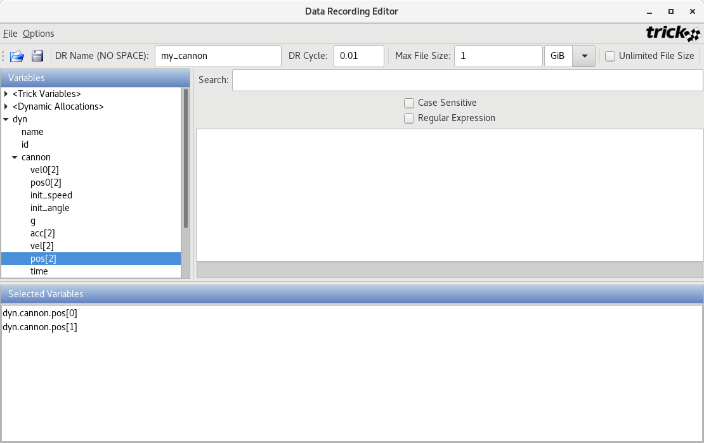

| [Home](/trick) → [Tutorial Home](Tutorial) → Recording Simulation Data |
|----------------------------------------------------------------------|

<!-- Section -->
<a id=recording-simulation-data></a>
## Recording Simulation Data

<a id=creating-a-data-recording-file-using-dre></a>
#### Creating A Data Recording File Using DRE

Recording data is possible when running real-time and non-real-time (as fast as
the computer will run). In order to record data, it is necessary to create a
"data recording file". You may create the file using a GUI called dre (data
recording editor --- aka Dr. Dre) or you may create it manually.

```bash
% cd $HOME/trick_sims/SIM_cannon_analytic
% mkdir Modified_data
% trick-dre &
```



**Figure 3 - Data Recording Editor (dre)**

* **Step 1.** In the "DR Name" entry box, enter my_cannon.
* **Step 2.** In the "DR Cycle" entry box, change 0.1 to 0.01.
* **Step 3.** In the "Variables" pane, double-click dyn, then double-click cannon.
* **Step 4.** Double-click pos[2]. The result should result in  dyn.cannon.pos[0]
and dyn.cannon.pos[1] appearing in the "Selected Variables" pane.
* **Step 5.** Choose File->Save. In the "Save" dialog, enter the file name
cannon.dr. Save cannon.dr in the Modified_data directory.
* **Step 6.** Exit dre.

Storing the data recording file `cannon.dr` into a directory called `Modified_data`
is not mandatory. It is just common convention. You may view `cannon.dr` it is a
text file.

<a id=running-the-simulation-and-recording-data></a>
#### Running The Simulation And Recording Data

The simulation must know about the data recording file created in the last
section. This is accomplished by adding execfile to the simulation input file.

```bash
% cd $HOME/trick_sims/SIM_cannon_analytic/RUN_test
% vi input.py
```

Add the line:

```python
 exec(open("Modified_data/data_record.dr").read())
```
to the top of the `input.py` file and then save it.

```bash
% cd ..
% ./S_main*.exe RUN_test/input.py
```

After the simulation runs, data will be dumped into the `RUN_test` directory.
The data, in this case, is recorded in binary form.

[Next Page](ATutPlottingData)
